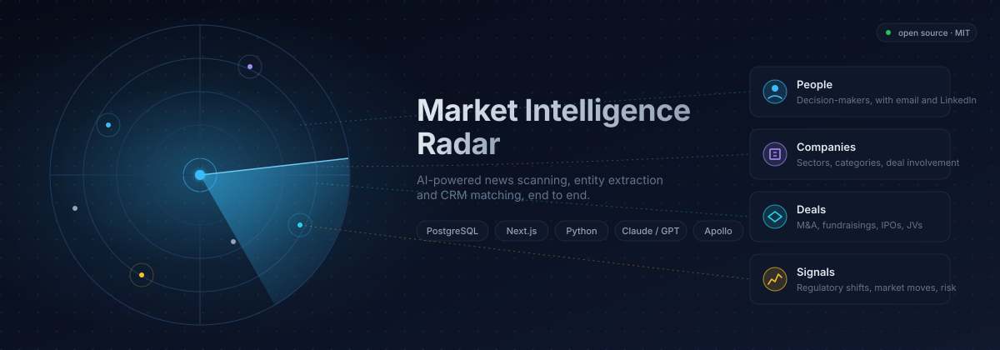
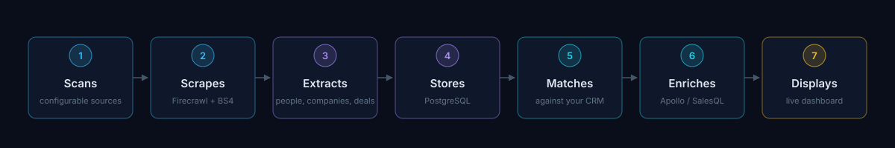
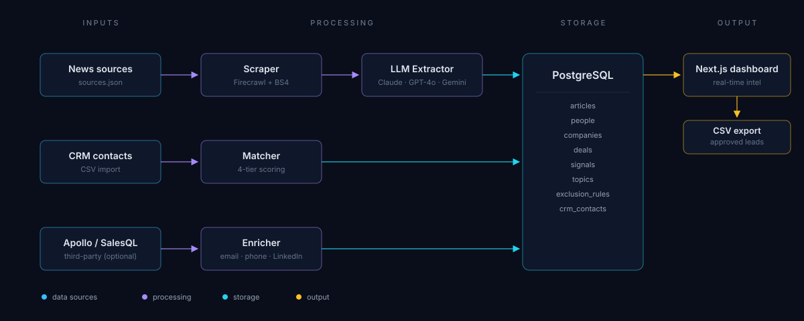

# Market Intelligence Radar (MIR)



An AI-powered market intelligence platform that automatically scans news sources, extracts structured intelligence (people, companies, deals, signals), and presents it in a real-time dashboard.

## What It Does



1. **Scans** configurable news sources for new articles
2. **Scrapes** article content (Firecrawl or requests+BeautifulSoup fallback)
3. **Extracts** structured intelligence using LLMs (Claude, GPT-4o, or Gemini)
4. **Stores** everything in PostgreSQL
5. **Matches** extracted people against your CRM contacts
6. **Enriches** contacts via Apollo/SalesQL (optional)
7. **Displays** everything in a sleek Next.js dashboard

## Quick Start

```bash
# 1. Clone the repo
git clone https://github.com/guifav/market-intelligence-radar.git
cd market-intelligence-radar

# 2. Configure required values
cp .env.example .env
# Edit .env — set LLM_API_KEY, POSTGRES_PASSWORD, AUTH_EMAIL, AUTH_PASSWORD, and AUTH_SECRET
# POSTGRES_PASSWORD=$(openssl rand -hex 24)
# AUTH_SECRET=$(openssl rand -hex 32)

# 3. Start with Docker Compose
docker compose up -d

# 4. Open the dashboard
open http://localhost:3000
# Login: use AUTH_EMAIL / AUTH_PASSWORD from .env
```

## Configuration

| Variable | Required | Default | Description |
|----------|----------|---------|-------------|
| `DATABASE_URL` | Yes | — | PostgreSQL connection string for manual setup; use the generated PostgreSQL password |
| `POSTGRES_PASSWORD` | Yes | — | PostgreSQL password for Docker Compose; generate with `openssl rand -hex 24` |
| `LLM_PROVIDER` | Yes | `anthropic` | LLM provider: `anthropic`, `openai`, or `gemini` |
| `LLM_API_KEY` | Yes | — | API key for your LLM provider |
| `LLM_MODEL` | No | Auto | Override the default model per provider |
| `AUTH_EMAIL` | Yes | — | Login email for the dashboard |
| `AUTH_PASSWORD` | Yes | — | Login password (minimum 12 characters; no default values) |
| `AUTH_SECRET` | Yes | — | JWT signing secret; generate with `openssl rand -hex 32` |
| `MIR_BIND_ADDRESS` | No | `127.0.0.1` | Application bind address for Docker Compose |
| `MIR_PORT` | No | `3000` | Application host port for Docker Compose |
| `FIRECRAWL_API_KEY` | No | — | Firecrawl API key for premium scraping |
| `APOLLO_API_KEY` | No | — | Apollo.io key for contact enrichment |
| `SALESQL_API_KEY` | No | — | SalesQL key for enrichment fallback |

> **Security note:** Docker Compose will not start until `POSTGRES_PASSWORD`, `AUTH_EMAIL`, `AUTH_PASSWORD`, and `AUTH_SECRET` are set. PostgreSQL is internal to the Compose network and is not published to the host. `MIR_BIND_ADDRESS=0.0.0.0` intentionally exposes only the application; use it only behind a TLS-terminating reverse proxy.

## Upgrading Existing Docker Compose Data

Fresh installs do not need a password migration: set strong values for `POSTGRES_PASSWORD`,
`AUTH_EMAIL`, `AUTH_PASSWORD`, and `AUTH_SECRET` in `.env`, then run
`docker compose up -d`.

Existing installations created with the earlier default Docker Compose configuration need an
explicit database password rotation. The `POSTGRES_PASSWORD` variable initializes PostgreSQL
only when the `pgdata` volume is first created; changing it later does not change the password
stored for the existing `mir` role.

1. Before replacing the current Compose configuration or changing the database password, back
   up the running database. If it is stopped, start it with the currently deployed configuration
   first.

   ```bash
   umask 077
   docker compose exec -T db pg_dump -U mir -d mir -Fc > mir-before-password-rotation.dump
   ```

2. Update the checkout, then configure strong new application credentials in `.env`. Temporarily
   keep the old database password so the existing volume remains reachable:

   ```dotenv
   AUTH_EMAIL=owner@company.com
   AUTH_PASSWORD=<a-strong-password-of-at-least-12-characters>
   AUTH_SECRET=<output-of-openssl-rand-hex-32>
   POSTGRES_PASSWORD=mir
   ```

3. Start only PostgreSQL:

   ```bash
   docker compose up -d db
   ```

4. Rotate the database password interactively so the new value is not written to shell history.
   Use a strong value from a password manager or the output of `openssl rand -hex 24` when
   prompted:

   ```bash
   docker compose exec db psql -U mir -d mir
   ```

   At the `psql` prompt:

   ```text
   \password mir
   \q
   ```

5. Replace the temporary `POSTGRES_PASSWORD=mir` in `.env` with the exact password entered at
   the prompt, then start the full stack:

   ```bash
   docker compose up -d
   ```

Do not delete the `pgdata` volume and do not run `docker compose down -v` during this upgrade;
either action deletes the existing database data. External or custom PostgreSQL installations
must rotate credentials through their database provider instead of following the built-in
Compose role procedure.

## Architecture



### Python Pipeline (`mir/`)
- `scanner.py` — Main orchestrator
- `scraper.py` — Article discovery and scraping
- `extractor.py` — LLM-based intelligence extraction
- `pg_storage.py` — PostgreSQL storage layer
- `enricher.py` — Contact enrichment (Apollo/SalesQL)
- `matcher.py` — CRM contact matching
- `llm.py` — Unified LLM interface

### Next.js Dashboard (`app/`)
- Real-time intelligence dashboard
- People, companies, deals, signals views
- Lead approval/rejection workflow
- CSV export

## Running the Pipeline

```bash
# Setup database tables
python3 -m mir.scanner --setup

# Scan all sources (max 5 articles each)
python3 -m mir.scanner --all --max-articles 5

# Scan with enrichment enabled
python3 -m mir.scanner --all --enrich

# Scan a specific division
python3 -m mir.scanner --division technology --max-articles 10
```

## Adding Sources

Edit `app/data/sources.json`:

```json
[
  {
    "name": "TechCrunch",
    "url": "https://techcrunch.com",
    "region_hint": "technology",
    "enabled": true
  }
]
```

## Importing CRM Contacts

Prepare a CSV with columns: `id`, `name`, `email`, `company`, `title`

```bash
python3 -m mir.crm_import contacts.csv
```

The matcher will automatically cross-reference extracted people against your CRM.

## Customizing Taxonomy

Edit `app/data/taxonomy.json` to define your own:
- Industry sectors
- Organization categories  
- Investment strategies
- Geographic regions

The extraction prompt adapts automatically to your taxonomy.

## Development

```bash
# Backend
pip install -r requirements.txt
python3 -m mir.scanner --setup

# Frontend
cd app
npm install
npm run dev
```

## Tech Stack

- **Backend:** Python 3.12, psycopg2, requests
- **Frontend:** Next.js 16, React 19, Tailwind CSS 4, shadcn/ui
- **Database:** PostgreSQL 16
- **LLM:** Anthropic Claude / OpenAI GPT-4o / Google Gemini
- **Scraping:** Firecrawl (premium) + requests+BeautifulSoup (fallback)
- **Enrichment:** Apollo.io + SalesQL (optional)

## License

MIT — see [LICENSE](LICENSE)
